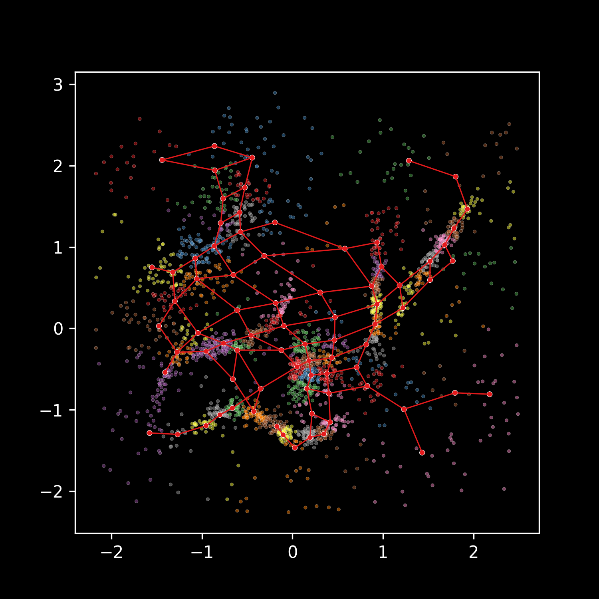
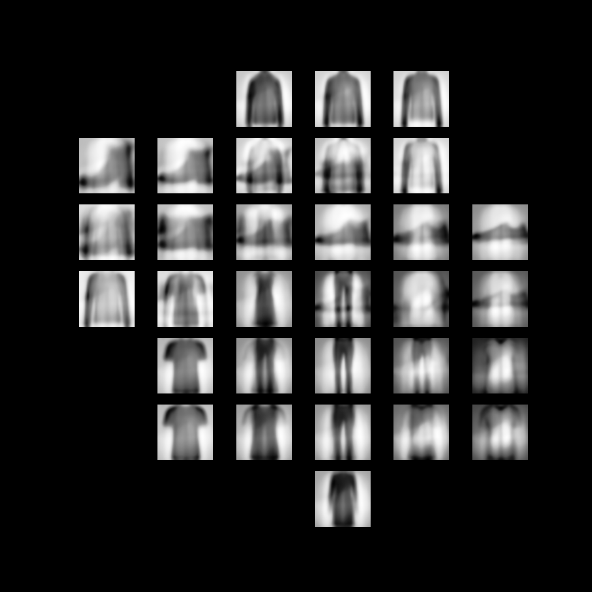
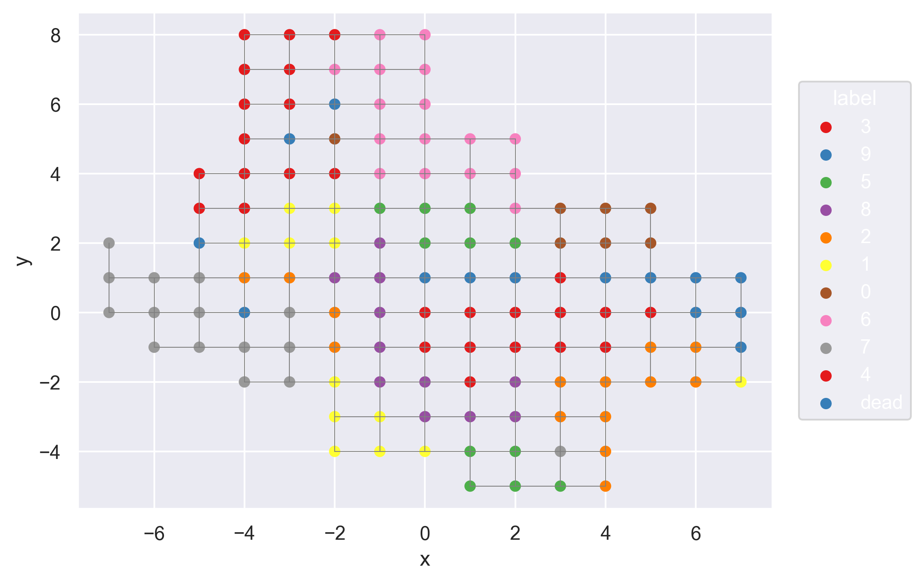
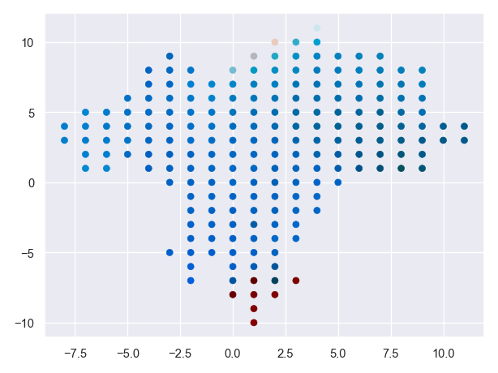
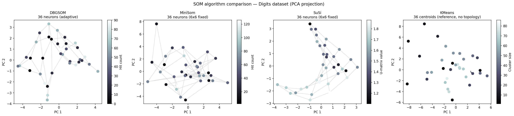
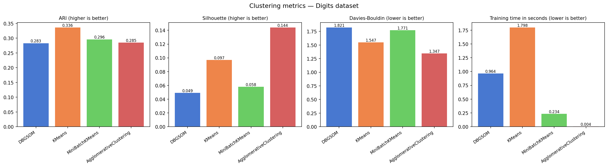

<!-- [](https://doi.org/10.5281/zenodo.20525611) -->

[](https://doi.org/10.5281/zenodo.20579347)
[](https://github.com/SandroMartens/DBGSOM/actions/workflows/python-package.yml)
[](https://github.com/SandroMartens/DBGSOM/actions/workflows/publish.yml)
[](https://github.com/SandroMartens/DBGSOM/actions/workflows/codeql.yml)
[](https://github.com/astral-sh/ruff)

# DBGSOM

DBGSOM (**D**irected **B**atch **G**rowing **S**elf-**O**rganizing **M**ap) is a Neural Network that can be used for Clusterung, Classification and Nonlinear Projection/Manifold learning and Data Visualization.

The network automaticallyly determines the number of prototypes needed to represent the data. Starting from 4 neurons, the map expands at boundary positions where quantization error exceeds a configurable threshold: no need to pre-specify cluster count. The result is a topology-preserving 2D grid where neighboring neurons represent similar inputs.

## Features

- **No cluster count needed** — the map grows until quantization error falls below threshold; `lambda_` controls sensitivity
- **sklearn-compatible** — drop-in for `KMeans`, `DBSCAN`: implements `fit_predict`, `transform`, `score`, and `predict_proba`
- **Topology-preserving** — related samples cluster as grid neighbors; topographic error < 5% on Digits
- **Faster than classical SOMs** — batch learning rule trains on all samples per epoch (vs. online, sample-by-sample)
- **Built-in visualization** — `plot()` renders the neuron grid coloured by density, label, error or hit count.

## How it works

**In brief:** Four neurons initialize → samples are assigned to nearest neuron → neuron weights update toward assigned samples → boundary neurons with high error spawn new neighbors → repeat until convergence threshold met or `mac-iter` reached. Neighoring neurons influence each others weight update -> Topology is preserved during training.

The DBGSOM algorithm builds a two-dimensional rectangular map of prototypes (neurons) where each neuron is connected to its four neighbors. Four neurons are initialized with random weight vectors drawn from the input data. During training every sample is assigned to its nearest neuron (best matching unit). The neuron weights are updated towards the mean of all samples mapped to them. Neighboring neurons influence each other's updates according to a neighborhood function so that the low-dimensional ordering of the map is preserved. The neighborhood width shrinks over time, allowing the map to first learn the global structure and then adapt to local structur. A growing mechanism expands the map as needed: new neurons are inserted at boundary positions where the quantization error exceeds a configurable growing threshold.

## How to install

### Download from PyPI

DBGSOM can be installed from PyPI via `uv` (recommended):

```bash
uv add dbgsom
```

or with pip:

```bash
pip install dbgsom
```

### Install from source

Clone the repository and install with `uv` (recommended):

```bash
git clone https://github.com/SandroMartens/DBGSOM.git
cd DBGSOM
uv sync
```

Alternatively with `pip`:

```bash
git clone https://github.com/SandroMartens/DBGSOM.git
cd DBGSOM
pip install -e .
```

## Usage

DBGSOM implements the scikit-learn API and provides two estimators:

| Class           | Use case                                      |
| --------------- | --------------------------------------------- |
| `SomVQ`         | Unsupervised clustering / vector quantization |
| `SomClassifier` | Supervised classification                     |

### Clustering / Vector Quantization

```python
from dbgsom import SomVQ
from sklearn.datasets import load_digits

X, y = load_digits(return_X_y=True)

vq = SomVQ(lambda_=80.0, max_neurons=80)
labels = vq.fit_predict(X)

print(f"Neurons: {len(vq.neurons_)}")
print(f"Quantization error: {vq.quantization_error_:.4f}")
print(f"Topographic error:  {vq.topographic_error_:.4f}")
```

Key growth parameters:

| Parameter     | Default               | Effect                                             |
| ------------- | --------------------- | -------------------------------------------------- |
| `lambda_`     | 115.0                 | Growing threshold — higher → fewer neurons         |
| `max_neurons` | `5 x sqrt(n_samples)` | Hard cap on neuron count                           |
| `n_iter`      | 500                   | Training epochs; growth only happens in first half |

### Classification

```python
from dbgsom import SomClassifier
from sklearn.datasets import load_digits
from sklearn.model_selection import train_test_split

X, y = load_digits(return_X_y=True)
X_train, X_test, y_train, y_test = train_test_split(X, y, random_state=42)

clf = SomClassifier(lambda_=80.0, max_neurons=80)
clf.fit(X_train, y_train)

print(clf.score(X_test, y_test))           # accuracy
proba = clf.predict_proba(X_test)          # class probabilities
```

### Transform

Both estimators implement `transform()`, which represents each sample as a sparse non-negative linear combination of the prototype weight vectors:

```python
coefs = vq.transform(X)   # shape (n_samples, n_prototypes)
```

### Visualization

`plot()` renders the SOM neurons as dots and the neighbourhood edges as grey lines, all via seaborn objects.

```python
vq.plot(color="density")                       # continuous -> colour gradient
clf.plot(color="label")                        # categorical -> colour legend
vq.plot(color="hit_count", pointsize="error")  # colour + size encoding
vq.plot(color="density", layout="pca", palette="magma_r")
```

Supported attributes for `color` / `pointsize`:
`'label'`, `'epoch_created'`, `'error'`, `'average_distance'`, `'density'`, `'hit_count'`

| Parameter   | Options                       | Description                                                                            |
| ----------- | ----------------------------- | -------------------------------------------------------------------------------------- |
| `color`     | any node attribute            | Numeric attributes → continuous colour scale; int/str with ≤ 20 unique values → legend |
| `pointsize` | any numeric attribute         | Node size proportional to attribute value                                              |
| `layout`    | `'grid'` _(default)_, `'pca'` | Node placement algorithm                                                               |
| `palette`   | any Matplotlib colormap       | Applied to the colour mapping                                                          |

## Examples

| Example                                                         | Description                                                                                                                                                                |
| --------------------------------------------------------------- | -------------------------------------------------------------------------------------------------------------------------------------------------------------------------- |
|                       | With two-dimensional input we can clearly see how the prototypes (red) approximate the input distribution (white) while preserving the square topology to their neighbors. |
|  | After training on the Fashion-MNIST dataset we can plot the weight of each prototype. Neighboring prototypes are pairwise similar.                                         |
|                    | Each prototype is coloured by its majority class. Samples from the same class cluster together. Trained on MNIST digits.                                                   |
|                  | Linear transformations like PCA can colour-code relative distances between prototypes in the input space. See the _darknet_ example notebook.                              |

## Comparisons

### SOM algorithm comparison (Digits, PCA projection)



_DBGSOM (dynamic grid, size determined automatically) vs. MiniSom and SuSi (fixed grids) vs. KMeans (no topology). All trained on the same Digits embedding._

### Clustering metrics (Digits dataset)



_ARI, Silhouette, Davies-Bouldin, and training time. All algorithms use the same number of clusters — the neuron count DBGSOM determined automatically._

Full benchmark notebooks:

| Notebook                                                              | What it shows                                                                              |
| --------------------------------------------------------------------- | ------------------------------------------------------------------------------------------ |
| [`clustering_comparison.ipynb`](examples/clustering_comparison.ipynb) | DBGSOM vs. KMeans, MiniBatchKMeans, AgglomerativeClustering on Iris and Digits             |
| [`som_comparison.ipynb`](examples/som_comparison.ipynb)               | DBGSOM vs. MiniSom, SuSi on Digits and Fashion-MNIST (QE, TE, training time, scaling)      |
| [`manifold_comparison.ipynb`](examples/manifold_comparison.ipynb)     | DBGSOM vs. Isomap, t-SNE, UMAP on MNIST: trustworthiness, continuity, folds/tears, runtime |

## Dependencies

- Python >= 3.12
- numpy
- numba
- NetworkX
- tqdm
- scikit-learn
- seaborn
- pandas

## Citation

If you use DBGSOM in your research, please cite:

Martens, S. (2025). DBGSOM: A Python implementation of the Directed Batch Growing Self-Organizing Map. Zenodo. <https://doi.org/10.5281/zenodo.20525611>

## References

- _A directed batch growing approach to enhance the topology preservation of self-organizing map_, Mahdi Vasighi and Homa Amini, 2017, <http://dx.doi.org/10.1016/j.asoc.2017.02.015>
- Reference implementation by the authors in Matlab: <https://github.com/mvasighi/DBGSOM>
- _Statistics-enhanced Direct Batch Growth Self-Organizing Mapping for efficient DoS Attack Detection_, Xiaofei Qu et al., 2019, [10.1109/ACCESS.2019.2922737](https://ieeexplore.ieee.org/document/8736234)
- _Entropy-Defined Direct Batch Growing Hierarchical Self-Organizing Mapping for Efficient Network Anomaly Detection_, Xiaofei Qu et al., 2021, 10.1109/ACCESS.2021.3064200
- _Self-Organizing Maps_, 3rd Edition, Teuvo Kohonen, 2003
- _MATLAB Implementations and Applications of the Self-Organizing Map_, Teuvo Kohonen, 2014
- _Smoothed self-organizing map for robust clustering_, P. D'Urso, L. De Giovanni and R. Massari, 2019, <https://doi.org/10.1016/j.ins.2019.06.038>

## License

dbgsom is licensed under the MIT license.
