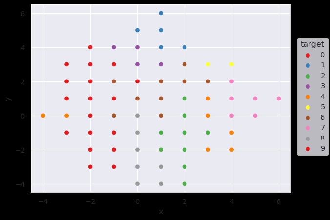

# DBGSOM

DBGSOM is short for _A directed batch growing approach to enhance the topology preservation of self-organizing map_ (SOM). A SOM is a type of artificial neural network that is used for supervised and unsupervised learning. It can be used for clustering, classification and many different data visualization tasks.

This project was inspired by the great [MiniSom](https://github.com/JustGlowing/minisom).

## Features

- Compatible with scikit-learn's API and can be used as a drop-in replacement for other clustering algorithms.
- Can handle high-dimensional and non-uniform data distributions.
- Good results without parameter tuning
- Fast convergence due to batch training
- Better topology preservation than classical SOMs

## How it works

The DBGSOM algorithm works by constructing a two-dimensional map of neurons, where each neuron is connected to its neighboring neurons. The neurons on the map are initialized with random weights. The input data is then presented to the SOM, and each neuron's weights are updated so that it becomes more similar to the input data. Each neurons affects it's neighbors to preserve the topological ordering of the map. The DBGSOM algorithm uses a growing mechanism to expand the map as needed. We add neurons the edge of the map where the quantization error of the boundary neurons is above a given growing threshold.

## How to install

(WiP)

```Powershell
git clone https://github.com/SandroMartens/DBGSOM.git
cd dbgsom
pip install -e .
```

## Usage

dbgsom implements the scikit-learn API.

```Python
from dbgsom import DBGSOM

quantizer = DBGSOM()
quantizer.fit(X=data_train)
labels_train = quantizer.labels_
labels_test = quantizer.predict(X=data_test)

```

## Examples

Here are a few use cases for dbgsom (WiP)

### Fashion Mnist

|||
|-|-|
| |  |

### Color Quantization

## Dependencies

- Numpy
- NetworkX
- tqdm
- scikit-learn
- pynndescent

## References

- _A directed batch growing approach to enhance the topology preservation of self-organizing map_, Mahdi Vasighi and Homa Amini, 2017, <http://dx.doi.org/10.1016/j.asoc.2017.02.015>
- Reference implementation by the authors in Matlab: <https://github.com/mvasighi/DBGSOM>
- _Statistics-enhanced Direct Batch Growth Self- organizing Mapping for efficient DoS Attack Detection_, Xiaofei Qu et al, 2019, [10.1109/ACCESS.2019.2922737](https://ieeexplore.ieee.org/document/8736234)
- _Self-Organizing Maps_, 3rd Edition, Teuvo Kohonen, 2003
- _MATLAB Implementations and Applications of the Self-Organizing Map_, Teuvo Kohonen, 2014

## License

dbgsom is licensed under the MIT license.
