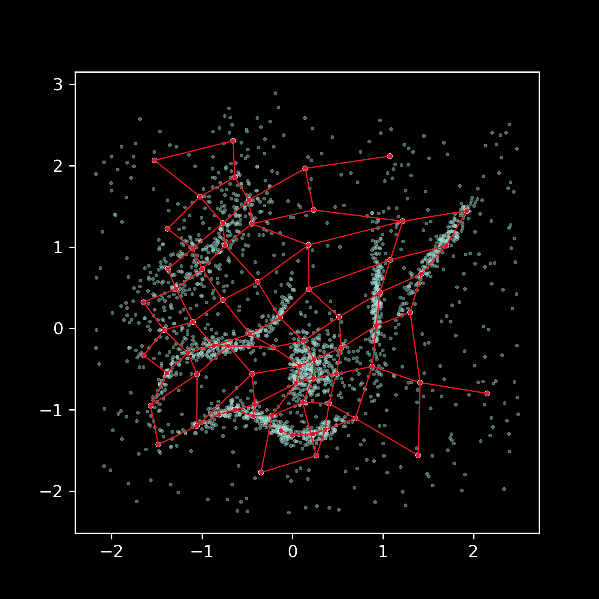
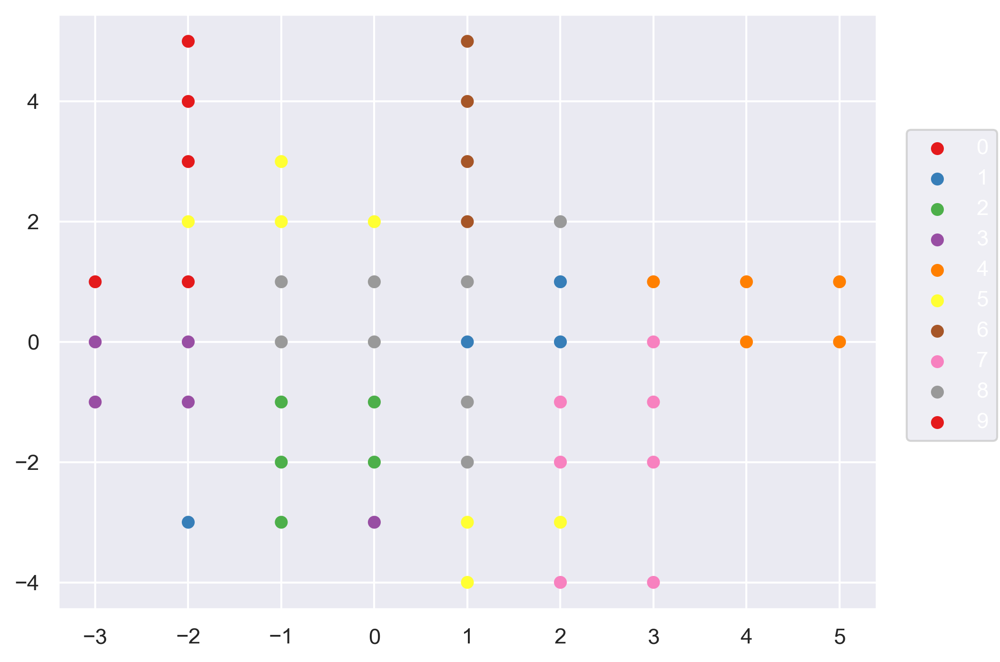
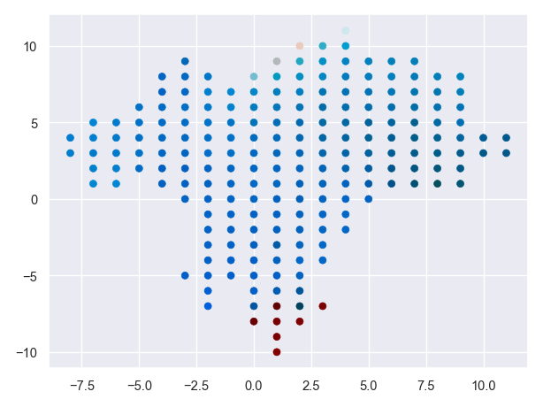

[](https://github.com/SandroMartens/DBGSOM/actions/workflows/python-package.yml)
[](https://github.com/SandroMartens/DBGSOM/actions/workflows/python-publish.yml)

# DBGSOM

DBGSOM is short for _Directed Batch Growing Self-Organizing Map_. A SOM is a type of artificial neural network that is used to to produce a low-dimensional  representation of a higher dimensional data set while preserving the topological structure of the data. It can be used for supervised and unsupervised vector quantization, classification and many different data visualization tasks.

## Features

- Compatible with scikit-learn's API and can be used as a drop-in replacement for other clustering and classification algorithms
- Can handle high-dimensional and non-uniform data distributions
- Good results without parameter tuning
- Better topology preservation and faster training time than classical SOMs
- Interpretability of the results through plotting

## How it works

The DBGSOM algorithm works by constructing a two-dimensional map of prototypes (neurons) where each neuron is connected to its neighbors. The first neurons on the map are initialized with random weights from the input data. The input data is then presented to the SOM. Each sample gets assigned to it's nearest neuron. The neuron weights are then updated to the samples that were mapped to each neuron. Neighboring neurons affect each others updates, so the low dimensional ordering of the map is preserved. The DBGSOM algorithm uses a growing mechanism to expand the map as needed. New neurons are added to the edge of the map where the quantization error of the boundary neurons is above a given growing threshold.

## How to install

DBGSOM can be installed from PyPi via pip.

```Bash
pip install DBGSOM
```

## Usage

dbgsom implements the scikit-learn API. We have the SomClassifier and SomVQ for classification and clustering/vector quantization.

```Python
from dbgsom import SomVQ, SomClassifier
from sklearn.datasets import load_digits

digits_X, digits_y = load_digits(return_X_y=True)

quantizer = SomVQ()
classifier = SomClassifier()

quantizer.fit_predict(X=digits_X)
classifier.fit_predict(X=digits_X, y=digits_y)

```

## Examples

Here are a few example use cases for DBGSOM.

|Example|Description|
|-|-|
|| With a two dimensional input we can clearly see how the protoypes (red) approximate the input distribution (white) while still preserving the square topology to their neighbors.|
| | After training the SOM on the fashion mnist dataset we can plot the nearest neighbor of each prototype. We can see that the SOM ordered the prototypes in a way that neighboring prototypes are pairwise similar. |
| | We can show the majority class each prototype represents. Samples from the same class are clustered together. The SOM was train on mnist digits.|
| | We can use linear transformations like PCA to color code relative distances between prototypes in the input space. See _darknet_ example notebook.

## Dependencies

- Python > 3.7
- Numpy
- NetworkX
- tqdm
- scikit-learn
- seaborn
- pandas

## References

- _A directed batch growing approach to enhance the topology preservation of self-organizing map_, Mahdi Vasighi and Homa Amini, 2017, <http://dx.doi.org/10.1016/j.asoc.2017.02.015>
- Reference implementation by the authors in Matlab: <https://github.com/mvasighi/DBGSOM>
- _Statistics-enhanced Direct Batch Growth Self- organizing Mapping for efficient DoS Attack Detection_, Xiaofei Qu et al., 2019, [10.1109/ACCESS.2019.2922737](https://ieeexplore.ieee.org/document/8736234)
- _Entropy-Defined Direct Batch Growing Hierarchical Self-Organizing Mapping for Efficient Network Anomaly Detection_, Xiaofei Qu et al., 2021 10.1109/ACCESS.2021.3064200
- _Self-Organizing Maps_, 3rd Edition, Teuvo Kohonen, 2003
- _MATLAB Implementations and Applications of the Self-Organizing Map_, Teuvo Kohonen, 2014
- _Smoothed self-organizing map for robust clustering_, P. D’Urso, L. De Giovanni and R. Massari, 2019, <https://doi.org/10.1016/j.ins.2019.06.038>

## License

dbgsom is licensed under the MIT license.
