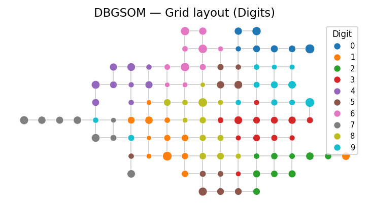
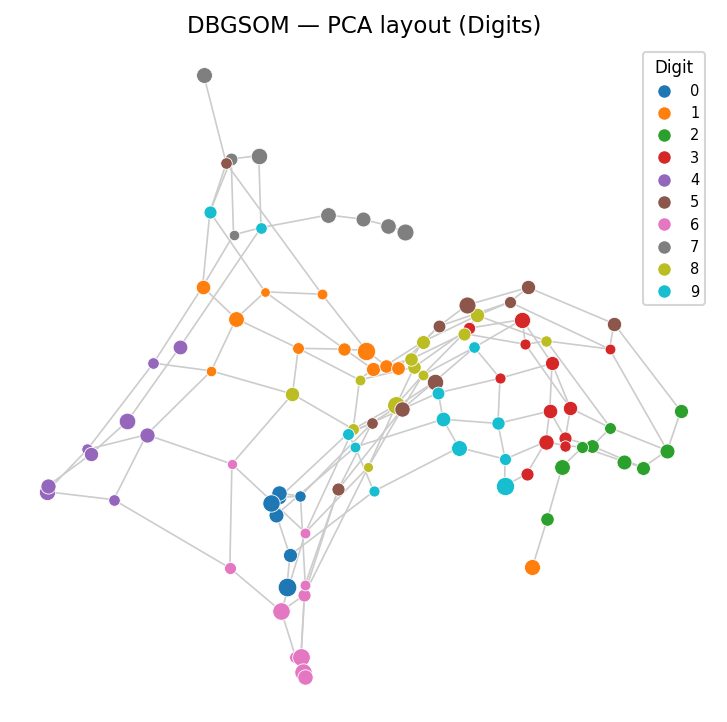
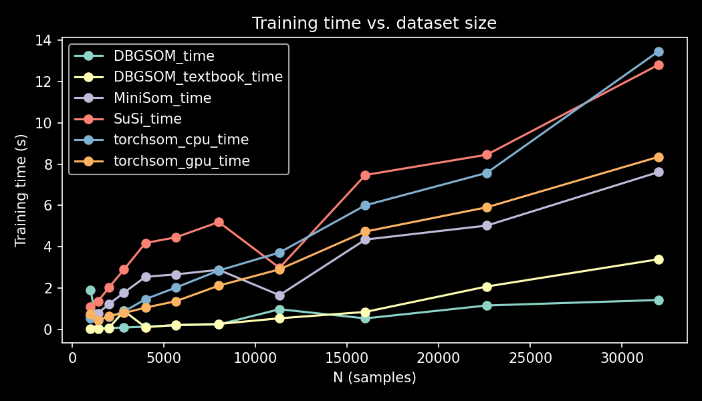

# Summary

Self-Organizing Maps (SOMs) [@Kohonen2001; @Kohonen2013] are unsupervised neural networks that learn a topology-preserving, low-dimensional representation of high-dimensional input data. The network maps input samples onto a discrete grid of prototype neurons such that similar inputs activate spatially proximate neurons. SOMs can be used for classification, clustering, vector quantization and nonlinear projection.

<!-- Classical SOMs require the grid dimensions to be specified prior to training, which in practice demands domain knowledge or trial-and-error tuning. -->

`DBGSOM` is based on the Directed Batch Growing Self-Organizing Map algorithm of @Vasighi2017 in Python. Starting from four initial neurons, the map first learns and then grows autonomously recursively in a number of convergence cycles. This happens by inserting new neurons at boundary positions at the end of each cycle where the local quantization error exceeds a configurable threshold. Training follows the batch learning rule, in which weight updates are computed over the entire dataset per epoch rather than sample-by-sample, yielding faster convergence than online SOMs. The resulting map size is determined by the data, eliminating the need to pre-specify the number of prototypes.

The library provides two estimators: `SomVQ` for unsupervised vector quantization and clustering, and `SomClassifier` for supervised classification, that integrate directly into standard machine learning workflows.

# Statement of Need

scikit-learn [@Pedregosa2012] is one of the most used Python libraries for non-deep-learning machine learning. This is because it allows end-to-end processing from pre-processing, training to scoring many different estimators. The core library of scikit-learn doesn't contain any self-organizing maps.

`DBGSOM` addresses one of the major drawbacks of classical SOMs: The need to specify the layout and size of the map before the training. A single sensitivity parameter (`lambda`) lets the map grow until the desired accuracy is met. The scikit-learn-compatible API, including `fit`, `predict`, `fit_predict`, `transform`, and `predict_proba`, enables drop-in use in cross-validation pipelines, `Pipeline` objects, and `GridSearchCV`.

The `transform` method departs from conventional SOM practice: rather than returning the index of the best-matching unit, it computes a sparse non-negative linear combination of prototype weights, yielding a meaningful embedding of each sample in prototype space [@Kohonen2007]. This allows a better encoding than the direct n-to-1 mapping to a single winner neuron. This representation is compatible with downstream scikit-learn estimators and dimensionality reduction workflows.

DBGSOM implements a number of changes to the textbook algorithm, that massively improve the speed of computation and allow scaling to larger datasets and larger networks.

The intended audience for DBGSOM is machine learning researchers working with SOMs and general data science practiciners who use the scikit-learn ecosystem.

# State of the field

Several Python SOM libraries exist, most notably MiniSom [@Vettigli2018], torchsom [@Berthier2025] and SuSi [@Riese2025]. All three implement fixed-grid SOMs that require the user to specify the grid dimensions before training. Selecting an appropriate grid size is non-trivial: too small a grid underfits the data; too large a grid wastes capacity and produces uninformative prototypes. In practice, users typically run multiple configurations and evaluate clustering metrics post-hoc.

Compared to MiniSom and SuSi on the Digits dataset, DBGSOM achieves competitive quantization and topographic error while reducing the number of hyperparameters the user must specify (see Benchmarks section).

Since the GSOM has a dynamically changing grid, it cannot easiely implemented into an existing library without rewriting most of the core logic.

# Software design

The DBGSOM training procedure proceeds as follows:

1. **Initialization.** Four neurons are initialized with weights sampled from the input data. Neurons are arranged on a rectangular grid so that they form a square.
2. **Assignment.** Each training sample is assigned to its nearest neuron (Best Matching Unit, BMU) by Euclidean distance or Cosine distance.
3. **Weight update.** Neuron weights are updated toward the mean of the samples assigned to them. A neighorhood function lets neurons influence their neighbors weight update.
4. **Growth.** Boundary neurons whose accumulated quantization error exceeds the growing threshold $GT = \lambda \cdot \lVert \text{std}(X) \rVert$ spawn new neighboring neurons. Growth is restricted to the first half of training to ensure convergence.
5. **Termination.** Growth ends when no boundary neurons fulfill $Qe_i > GT$ or `max_neurons` is reached. Training ends when `n_iter` epochs are completed or the map converged.

The neighborhood width $\sigma$ decays over training epochs, transitioning the map from global to local organization.
Topology preservation is measured by the topographic error `Te` or topographic function `Tf`[@Villmann1997]. `Te` is defined as the proportion of samples for which the first and second BMU are not on adjacent edges on the map grid. The `Tf` measures folds and tears by computing how close or far neuron pairs are in the feature space.

# Research impact statement

Benchmarks comparing DBGSOM to MiniSom, SuSi, KMeans, and AgglomerativeClustering are provided in the repository as Jupyter notebooks (`examples/som_comparison.ipynb`, `examples/clustering_comparison.ipynb`, `examples/manifold_comparison.ipynb`). Evaluations use the scikit-learn Digits dataset (1797 samples, 64 features, 10 classes) and the Fashion-MNIST dataset [@Xiao2017].

On Fashion MNIST (10k samples) with automatically determined cluster count (via DBGSOM's growing mechanism, applied as cluster count for all algorithms):

| Algorithm | n_prototypes | Time (s) | QE     | TE     | ARI   | Silhouette |
| --------- | ------------ | -------- | ------ | ------ | ----- | ---------- |
| DBGSOM    | 107          | 1.064    | 4.8767 | 0.0264 | 0.169 | -0.038     |
| MiniSom   | 121          | 0.721    | 4.7559 | 0.1583 | 0.172 | 0.026      |
| SuSi      | 121          | 0.137    | 5.688  | 0.0861 | 0.252 | -0.076     |
| torchsom  | 121          | 0.63     | 6.8255 | 0.3722 | 0.44  | -0.029     |

Lower bound for `Qe` using kmeans: `15.7153`.

`DBGSOM` is implemented in Python and uses NumPy [@Harris2020] for array operations and Numba [@Lam2015] for JIT-compiled distance computations. The map topology is represented as a NetworkX [@Hagberg2008] graph, which simplifies the implementation of neighborhood queries and the growth mechanism. Visualization is provided via seaborn objects [@Waskom2021], supporting continuous and categorical color encoding of prototype attributes.

The package is distributed via PyPI (`pip install dbgsom`) and versioned according to semantic versioning. Continuous integration is configured via GitHub Actions, including unit tests, code quality checks with Ruff, and automated PyPI releases.

|                           Grid projection                            |                           PCA projection                           |
| :------------------------------------------------------------------: | :----------------------------------------------------------------: |
| {width=80%} | {width=80%} |

{width=80%}

# AI usage disclosure

No generative AI was used prior to release v1.2.0. Claude Code was used in Code: to create benchmarks, refactor code, improve performance, implement mathematical formulas, debugging. In documentation: Mainly for editing and keeping consistency between reference papers, documentation and actual implementation.

# References
